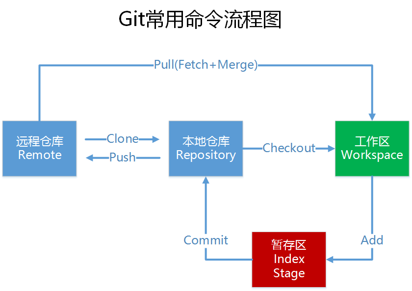

# git learn note
## 对用户和email进行设置：
可以通过 --system --global  默认 等对不同的配置文件进行修改
- git config --global user.name "name"
- git cinfig --global user.email "email"  
 配置系统用户的名称与邮件信息，每一个git的提交都会使用这些信息，不可更改

## git 下的工作方式


## git 换行符问题
### 2.1、autocrlf
  #提交时转换为LF，检出时转换为CRLF  
  git config --global core.autocrlf true

  #提交时转换为LF，检出时不转换  
  git config --global core.autocrlf input

  #提交检出均不转换   
  git config --global core.autocrlf false

### 2.2、safecrlf
  #拒绝提交包含混合换行符的文件   
  git config --global core.safecrlf true

  #允许提交包含混合换行符的文件  
  git config --global core.safecrlf false

  #提交包含混合换行符的文件时给出警告   
  git config --global core.safecrlf warn

## 创建版本库
- git init
<br />创建了.git目录及git仓库所必须的文件

git  管理的是修改

## 向版本库中提交文件
- step1: git add file_name      可反复提交，添加多个文件
- step2: git commit -m "commit"

## 查看版本库的状态
- git status

## 查看文件的修改内容
- git diff

## 查看修改历史记录
- git log
- git log --pretty=oneline  简洁形式显示

## 进行版本回退
- HEAD 当前版本
- HEAD^ 上一个版本
- HEAD^^ 上上个版本
- HEAD~100 上100个版本
- git reset --hard HEAD^ 回到上一个版本

## 回到新版本
- git reflog  查找提交命令
- git reset --hard commit_id

## 撤销修改
- git checkout -- file_name
<br />让工作区的文件回到最近一次的 git commit 或 git add的状态
- git reset HEAD file 可以将暂存区的修改撤销掉，重新放回工作区
git checkot 就是用版本库中的版本工作区的版本

## 从版本库中删除文件
- git rm file_name
- git commit -m "commit"

## 创建并切换到分支
- git checkout -b branch_name

## 创建分支
- git branch branch_name

## 切换分支
- git checkout branch_name

## 查看所有分支
- git branch

## 合并某一个分支到当前的分支
- git merge branch_name

## 删除分支
- git branch -d branch_name

## 解决冲突之后我们可以使用下面的命令进行查重
- git log --graph --pretty=oneline --abbrev-commit

## 禁用快速合并
- --no-ff
- git merge --no-ff -m "commit" <branch_name>

分支策略：
git的 master 分支十分稳定，一般用来发布版本。一般在 dev 分支上面提交代码

## 保存分支现场(工作未完成时)
- git stash

## 查看分支保存的现场
-　git stash list 查重现场内容

## 恢复现场
- git stash apply
- git stash drop   删除现场

- git stash pop 恢复并删除现场

## 丢弃一个未曾合并的分支
- git branch -D <branch_name>

## 查看远程仓库
- git remote
origin 是远程仓库的默认名称
- git remote -v 查看详细信息

## 推送分支（推送时要指定本地分支）
- git push origin master
- master分支是主分支，因此要时刻与远程同步；
- dev分支是开发分支，团队所有成员都需要在上面工作，所以也需要与远程同步；
- bug分支只用于在本地修复bug，就没必要推到远程了，除非老板要看看你每周到底修复了几个bug；
- feature分支是否推到远程，取决于你是否和你的小伙伴合作在上面开发。

## 标签创建
切换到需要建立标签的分支
- git checkout branch_name
- git tag <name> 或者 git tag <name> commit_id  
 -a 可以指定标签名  
 -m 进行注释说明  
 -s 用私钥签名一个标签  

## 查重tag信息
- git show <tagname>  显示标签的信息

## 删除本地标签
- git tag -d <tagname>
- git push origin :refs/tags/<tagname>

## 向远程仓库推送标签
- git push origin --tags

## 拉取远程仓库中的分支
- git pull
- 先设置远程分支与本地分支的关联
##　设置本地分支与远程分支的关联
- git branch --set-upstream branch-name orgin/branch-name

多人协作的工作模式通常是这样：<br />
首先，可以试图用git push origin branch-name推送自己的修改；<br />
如果推送失败，则因为远程分支比你的本地更新，需要先用git pull试图合并；<br />
如果合并有冲突，则解决冲突，并在本地提交；<br />
没有冲突或者解决掉冲突后，再用git push origin branch-name推送就能成功！<br />
如果git pull提示“no tracking information”，则说明本地分支和远程分支的链接关系没有创建，<br />
用命令git branch --set-upstream branch-name origin/branch-name。

## 忽略一些特殊的文件
使用.gitignore文件

## 命名别名
- git config --global alias.new_name old_name

git config --global alias.lg "log --color --graph --pretty=format:'%Cred%h%Creset -%C(yellow)%d%Creset %s %Cgreen(%cr) %C(bold blue)<%an>%Creset' --abbrev-commit"


2016.07.30
## git config
1. /etc/gitconfig : 包含系统上的每一个用户及他们仓库的通用配置  
  通过 git config --system 对其进行修改
2. ~/.gitconfig or ~/.config/git/config :只针对当前用户  
  通过 git config --global 对此文件进行读写
3. .git/config 对本仓库进行配置  
  可以通过git config --local 对此文件进行配置，可以省略--local参数  
每一级别覆盖上一个级别的配置。  
windows下，在$HOME目录下的.gitconfig文件中  

可以通过 git config --global core.editor emacs 进行文本编辑器进行配置  
默认的文本编辑器是vim  
检查配置信息  
- git config --list
- git config <key> 检查某一项配置

#### 获取帮助
-  git help <verb>
-  git <verb> help
-  man git-<verb>
#### 克隆项目仓库
-  git clone [url]  
  此命令会将运程仓库中每一个文件的版本都拉取下来
-  git clone [url] new-name  
  克隆仓库并自定义仓库名称
#### 查重工作目录状态
-  git status
-  git status -s/--short 以更紧凑的形式输出
忽略文件

#### 创建 .gitignore 文件
  [ignore file](http://github.com/github/gitignore) github上的各种ignore文件
##### ignore 格式规范
- 所有空行或者以 ＃ 开头的行都会被 Git 忽略。
- 可以使用标准的 glob 模式匹配。
- 匹配模式可以以（/）开头防止递归。
- 匹配模式可以以（/）结尾指定目录。
- 要忽略指定模式以外的文件或目录，可以在模式前加上惊叹号（!）取反  
```
所谓的 glob 模式是指 shell 所使用的简化了的正则表达式。星号（*）匹配零个或多个任意字符；[abc] 匹配任
何一个列在方括号中的字符（这个例子要么匹配一个 a，要么匹配一个 b，要么匹配一个 c）；问号（?）只匹配
一个任意字符；如果在方括号中使用短划线分隔两个字符，表示所有在这两个字符范围内的都可以匹配（比如
[0-9] 表示匹配所有 0 到 9 的数字）。使用两个星号（*) 表示匹配任意中间目录，比如`a/**/z` 可以匹配 a/z,
a/b/z 或 `a/b/c/z`等。
```
#### 对比已暂存文件与未暂存文件的修改
-  git diff
-  git diff --staged/--cached
#### 跳过暂存区
  git commit -a
  可以将已跟踪过的文件暂存起来一并提交
#### 移除文件
  git rm
  将文件从已跟踪文件清单中移除（即从暂存区移除）
  git rm --cached
  删除gi仓库中的文件，文件将不再被跟踪
#### 重命名
-  git mv old_name new-name
  相当于
-  mv old-name new-name
-  git remove old-name
-  git add new-name
#### 查重提交日志
-  git log
-  -p 显示每次提交内容的差异
-  -2 显示最近再次提交
-  --stat 显示简略的统计信息
-  --pretty 可以设置信息显示的格式
-  --since
-  --util
#### 撤消操作
-  git commit --amend
#### 取消暂存的文件
-  git reset HEAD file-name
#### 撤消对文件的修改
-  git checkout -- file-name
#### 远程仓库
-  git remote 查看远程仓库
  -v 显示远程仓库的名称及其url
-  git remote show <remote-name> 查重详细信息
-  git remote add <shortname> <url> 添加一个远程仓库并指定一个简写
-  git fetch <shortname> 拉取仓库，<shortname>可以指代仓库的URL
-  git pull
#### 推送到远程仓库
-  git push [remote-name] [branch-name]
-  git remote rename old-name new-name
-  git remote rm rep-name
#### 标签
  git的标签分为两种：轻量标签与附注标签
  git tag
-   -a 创建附注标签
-  git tag -a tag-name -m "commit"
#### 创建轻量标签
-  git tag tag-name
#### 共享标签
-  git push origin tag-name
-  git push origin --tags 将不在远程服务器上的标签进行推送
#### git别名
-  git config --global alias.co checkout

2016年8月4日
### git的分支，其本质上是指向提交对象的可变指针
#### 创建分支
-  git branch branch-name  
  HEAD指针会指向当前的的分支
#### 切换分支
-  git checkout branch-name  
  分支切换会改变工作目录中的文件
#### 合并其他分支到当前分支
-  git merge branch-name
#### 删除分支
-  git branch -d branch-name   

-----------
2016年8月8日
###  git 跟踪分支：
  从一个远程跟踪分支检出一个本地分支会自动创建一个跟踪分支。是与远程分支有直接关系的本地分支。  
  git fetch 从服务器抓取本地没有的数据，不会自动merge到当前分支当中，不会修改工作目录中的内容。  
  git pull <==> 获取最新的版本，并merge到当前分支中，相当于 git fetch ; git merge  
  最好是使用 git fetch origin 再使用 git merge,这样可以对代码的改变有更清楚的了解。

#### 变基
-    rebase 通过变基可以使提交历史看起来是串行的，使提交历史更简洁。
-    git rebase [basebranch] [topicbranch]  
  不要对你的仓库外有副本的分支执行变基  
  只对尚未推送或分享给别人的本地修改执行变基操作清理历史，从不对已推送至别处的提交执行变基操作

## 2016年10月27日
#### git知识
git对待数据像一个快照流，如果文件没有修改，git不再重新存储此文件，而是保留一个链接指向之前存储的文件。  
git提交时保存的是全部文件的一个快照。
git 一般只添加数据   

git 有三种状态：已提交(committed), 已修改(modified), 已暂存(staged)


git 的文件有如下的生命周期


### git log 出现中方乱码问题
```
git config --global i18n.commitencoding utf-8
git config --global i18n.logoutputencoding gbk
```
设置commit提交时使用 utf-8 编码，避免在linux下出现问题，
设置在git log时将utf-8 转换为gbk编码，解决乱码问题