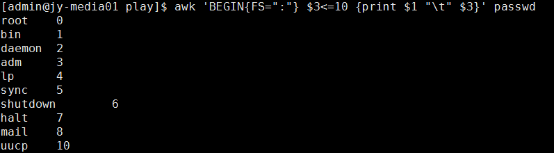

# awk linux
awk 文本处理命令，将一行文本划分为一个个的区域进行处理，
## 使用方法 
'''
awk '条件类型1{动作1}条件类型2{2}' filename
'''
## 默认分隔符
空格键 或 tab 键 
## 变量
$0  代表整行 
$1 代表第一个区域, $2,$3类似
NF 每一行处理的字段数
NR 目前处理到第几行
FS 目前的分隔符
BEGIN END 进行初始化与收尾的工作
## 逻辑判断 
> < >= <= == !==
赋值 =
## 正则表达式
在 // 之间使用正则表达式进行匹配

## 示例
1. 以 : 为分隔将 user 与 uid输出，同时处理第一行文本数据
`awk 'BEGIN{FS=":"} $3<=10 {print $1 "\t" $3}' passwd`

2. 正则表达式匹配 ftp 并将这一行进行输出 
```
awk '/ftp/ {print $0}' passwd
```

