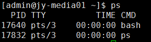
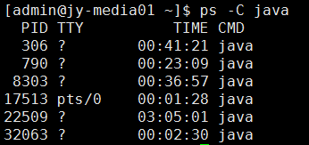
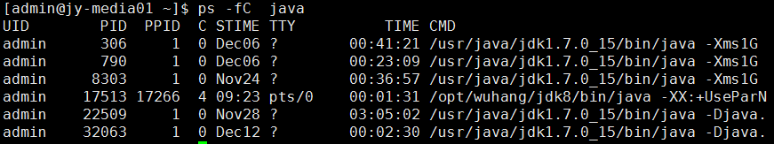

# ps linux
## 语法格式
1. UNIX风格：选项可以组合在一起，并且选项前必须有“-”连字符
2. BSD风格：选项可以组合在一起，但是选项前不能有“-”连字符
3. GNU风格：项前有两个“-”连字符

##示例
1. 不加参数的使用ps命令
   
   PID: 运行着的命令(CMD)的进程编号
   TTY: 命令所运行的位置（终端）
   TIME: 运行着的该命令所占用的CPU处理时间
   CMD: 该进程所运行的命令
2. 查看所有进程 -a = all   -x 显示没有终端的进程
   `ps -ax`
3. 根据用户过滤进程  -u 指定用户
   `ps -u root`
4. 根据cpu使用升序排序：
   `ps -aux --sort -pcpu | less`
5. 根据内存使用升序排序：
   `ps -aux --sort -pmem | less`
6. 通过进程名和PID过滤 -C 指定进程名或PID
   `ps -C　java`
    
   `ps -C -f　java`
    
7. 根据进程查重线程
   `ps -L pid`
8. 树形显示进程
   `ps -axjf`或 `pstree`
