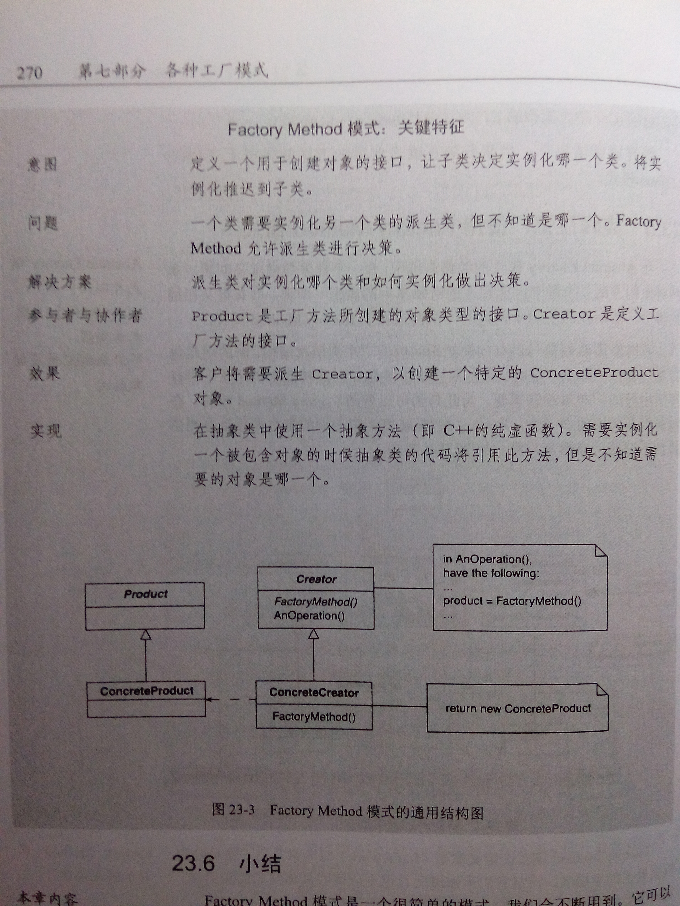

# 设计模式解析笔记
## chapter 1:
	功能分解 functional decomposition
	委托 delegation
	需求总在变化
	用模块化封装变化－－> 问题：低内聚（weak cohesion），紧耦合(tight coupling)
	内聚性（cohesion）：例程中操作之间联系的紧密程度
	耦合性（coupling）: 两个例程之间联系的紧密程度
	软件开发目标：高内聚，松耦合
	
	责任的转移
	概念：软件要负责什么
	规约：怎么使用软件 
	实现：软件怎样履行自己的责任
	对象：对象应该自己负责自己，而且应该清楚地定义责任。
		概念层次：对象是一组责任；
		规约层次：对象是一组可以被其他对象或对象自己调用的方法。
		实现层次：对象是代码和数据，以及它们之间的计算交互。
		
		对象具有供其他对象使用的接口。public interface
	类是对象行为的定义。
	包括：1，对象所包含的数据元素；
		  2，对象能够操作的方法
		  3，访问这些数据和方法的方式。
	对象是类的一个实例（instance）
	创建类实例的过程称为实例化（instantiation）
	抽象类是类的抽象。（不能用于实例化对象）
	具体类代表着一个概念特定的、不变的实现
	抽象类可以充当其他类的占位符
	is-a关系称之为继承（inheritance）
	特化 specialize
	泛化 generalize
	
	公开 public
	保护 protected 类及其派生类的对象能够看见。
	私有 private
	封装 encapsulation
	多态 polymorphism
	
	构造函数 constructor
	析构函数 destructor

  

chapter 2 UML
	is-a :一个类是另一个类的子类
	has-a:一个类包含另一个类
	use-a:一个类使用另一个类
	一个类创建另一个类。
	组合 composition：被包含含者是包含者的一部分
	聚集 aggregation: 有一个集合，集合中东西可以独立存在。
	+  公开
	－ 私有
	#  保护
	
## chapter 5 five
	模式的描述：
		1.模式的名称
		2.模式的目的，即要解决的问题
		3.实现的方法
		4.为了实现该模式我们必须考虑的限制和约束因素
	复用解决方案
	确立通用术语
	
	按接口编程
	尽量用聚合代替继承
	找出变化并封装之
## chapter 6 six
	Facade模式 
		为子系统中的一组接口提供一个统一接口
	意图		希望简化原有系统的使用方式。需要自己定义自己的接口。
	问题		只需要使用某个复杂系统的子集，或者，需要以一种特殊的方式与系统交互。
	解决方案	Facade为原有系统的客户提供了一个新的接口。
	参与者与协作者	为客户提供的一个简化接口，使系统更容易使用。
	效果		简化了对所需子系统的使用过程。
	实现		定义一个（或多个）具备所需接口的新类
				让新类使用原有的系统
	封装系统的原因：
		跟踪系统的使用情况。
		改换系统 
chapter 7 seven
	Adapter模式 常用于保持多态性
		将一个类的接口转换成客户希望的另外一个接口
	意图		使控制范围之外的一个原有对象与某个接口匹配。
	问题		系统的数据和行为都正确，但接口不符。通常用于必须从抽象类派生。
	解决方案 	提供了具有所需接口的包装类
	参与者与协作者
	效果		使原有对象能够适应新的类结构，不受接口的限制
	实现		将原有类包含在另一个类之中。让包装类与需要的接口匹配，调用被包容类的方法。
	
chapter 8 eight
	对象是具有责任的一个实体。
	关注动机而非实现。
	封装的多种层次
		数据的封装
		方法的封装
		其他对象的封装
		类型的封装
	发生变化并将其封装
	共性分析：找到变化的地点
	变性分析：找出如何变化
	创建对象时使用共性和可变性分析
	
	规约视角和概念视角的关系在于：规约标识了用来处理此概念所有情况所需的接口
	规约视角和实现视角的关系在于：对于给定的规约，怎样实现这个特殊情况。
	无冗余	可读	可测试
chapter 9 nine
	strategy模式 
	针对接口编程，而不要针对实现编程
	优先使用对象聚集，而不是类继承。
	1.寻找变化，并将它封装在一个单独的类中
	2.将这个类包含在另一个类中。
	定义一系列的算法，把它们一个个封装起来，并且使它们可相互替换。
	基础：1.对象都具有职责
		  2.这些职责不同的具体实现是通过多态的使用完成的
		  3.概念上相同的算法具有多个不同的实现，需要进行管理
chapter 10 ten
	Bridge模式 
	解耦：指不同事物互相独立地行事，或者至少明确地声明之间的关系
	抽象：是指不同事物之间概念上的联系方式。
	一条规则，实现一次。
chapter 11 elevent
	Abastrct Factory 模式
	switch语句可能说明需要抽象
	 1.需要多态行为；2.存在职责错放
	为创建一组相关或相互依赖的对象提供一个接口，而且无需指定它们的具体类。
	
chapter 13 thirteen
	用模式思考的过程 
	先考虑系统中需要什么，然后再去关注如何创建它们
	最高模式：指系统中为其他模式建立背景的一两个模式。
	理解如何在两个层次更有效地运用设计模式。
	理解其本质机制和它们背后的原则与策略。
	开闭原则：模块，方法和类应该对扩展开放，对修改封闭
	依赖倒置原则：
		高层模块不应该依赖于低层模块，高层模块和低层模块都应该依赖抽象。
		抽象不应该依赖细节。细节应该依赖于抽象。
	复杂化原则:
		从最简单（概念性）层次开始，然后逐渐添加细节和特征，设计也渐趋复杂的过程。
	一个从基类派生的类应该支持基类的所有行为。
	让使用对象甚至无法知道是否存在派生类。
chapter 17 seventeen
	Decorator model
	动态地给一个对象添加一些额外的职责。
chapter 18 eighteen
	Observer model
	定义对象间的一种一对多的依赖关系，当一个对象的状态发生改变时，
所有依赖于它的对象都将得到通知并自动更新。dependents
	变化：
		不同类型的对象
		不同的接口
	1.让观察者以同事以同样的方式工作
	2.让观察者注册自己
	3.事件发生时通知观察者
	4.从目标获取信息
chapter 19 ninteen
	Template Method
	定义一个操作中算法的骨架，而将一些步骤延迟到子类中。
不改变算法的结构而重定义它的步骤。
	有新需求需要处理时，采用以下两个步骤：
		1.先重构代码，不添加任何功能，这样加入新功能时可以遵守开闭原则。
		2.添加新的代码，只影响工厂类和新代码。
		
chapter 20 
	开发分为如下两步：
	1.定义对象和它们的协作方式
	2.编写为相应情况实例化对象并在对象共享时管理已有对象的工厂。
	对象的创建和管理：
		对象要么构造其他对象，要么使用其他对象，决不要两者兼顾。
chapter 21
singleton model
	保证一个类仅有一个实例，并提供一个访问它的全局访问点。
Double-Checked locking model
chapter 22 
	Object pool model 
chapter 23
	Factory Method model 
	定义一个用于创建对象的接口，让子类决定实例化哪一个类。
	此模式使一个类的实例化延迟到其子类。
chapter 25 
	总结
	面向对象原则的总结 
		对象是具有明确定义的责任的事物
		对象对自己负责
		封装指的是任何形式的隐藏：
			数据隐藏
			实现隐藏
			类隐藏
			设计隐藏
			实例化隐藏
		使用共性和可变性分析抽象出行为和数据的变化 
		按接口编程
		将继承看成一种将变化概念化的方法，而不是创建已有对象的特殊情形
		将变化放入一个类中，并与设计该中的其他变化解耦
		力求松耦合
		力求强内聚
		将使用一个对象的代码与创建该对象的代码分离
		在应用‘一次且仅一次’规则时要绝对小心
		通过“按意图编程”，使用反映意图的名字，确保代码的可读性
		在编程之前就考虑代码的可测试性
		
		

	
	
	
	
	
	
	
		  
	